Java-application-on-JBoss-EAP/Red-Hat-Enterprise-Linux-migration


<div class="MCWHeader1">
Java application on Jboss EAP/Red Hat Enterprise Linux migration
</div>

<div class="MCWHeader2">
Hands-on lab step-by-step
</div>

<div class="MCWHeader3">
April 2021
</div>


Information in this document, including URL and other Internet Web site references, is subject to change without notice. Unless otherwise noted, the example companies, organizations, products, domain names, e-mail addresses, logos, people, places, and events depicted herein are fictitious, and no association with any real company, organization, product, domain name, e-mail address, logo, person, place, or event is intended or should be inferred. Complying with all applicable copyright laws is the responsibility of the user. Without limiting the rights under copyright, no part of this document may be reproduced, stored in, or introduced into a retrieval system, or transmitted in any form or by any means (electronic, mechanical, photocopying, recording, or otherwise), or for any purpose, without the express written permission of Microsoft Corporation.

Microsoft may have patents, patent applications, trademarks, copyrights, or other intellectual property rights covering subject matter in this document. Except as expressly provided in any written license agreement from Microsoft, the furnishing of this document does not give you any license to these patents, trademarks, copyrights, or other intellectual property.

The names of manufacturers, products, or URLs are provided for informational purposes only and Microsoft makes no representations and warranties, either expressed, implied, or statutory, regarding these manufacturers or the use of the products with any Microsoft technologies. The inclusion of a manufacturer or product does not imply endorsement of Microsoft of the manufacturer or product. Links may be provided to third party sites. Such sites are not under the control of Microsoft and Microsoft is not responsible for the contents of any linked site or any link contained in a linked site, or any changes or updates to such sites. Microsoft is not responsible for webcasting or any other form of transmission received from any linked site. Microsoft is providing these links to you only as a convenience, and the inclusion of any link does not imply endorsement of Microsoft of the site, or the products contained therein.

© 2021 Microsoft Corporation. All rights reserved.

Microsoft and the trademarks listed at <https://www.microsoft.com/en-us/legal/intellectualproperty/Trademarks/Usage/General.aspx> are trademarks of the Microsoft group of companies. All other trademarks are property of their respective owners.

**Contents** 

<!-- TOC -->

- [Java application JBoss EAP/RHEL migration hands-on lab step-by-step](#java-application-Jboss-EAP/RHEL-migration-hands-on-lab-step-by-step)
  - [Abstract and learning objectives](#abstract-and-learning-objectives)
  - [Overview](#overview)
  - [Solution architecture](#solution-architecture)
  - [Requirements](#requirements)
  - [Before the hands-on lab](#before-the-hands-on-lab)
  - [Exercise 1: Discover the on-premises environment](#discover-the-on-premises-environment)
    - [Task 1: Create the Azure Migrate project and add assessment and migration tools(#create-the-azure-migrate-project-and-add-assessment-and-migration-tools)
    - [Task 2: Deploy and register the Azure Migrate appliance(#deploy-and-register-the-azure-migrate-appliance)
    - [Task 3: Migrate a server with Azure Migrate(#migrate-a-server-with-azure-migrate)
    - [Task 4: Post-migration steps(#post-migration-steps)

  - [After the hands-on lab](#after-the-hands-on-lab)
    - [Task 1: Clean up resources](#task-1-clean-up-resources)
<!-- /TOC -->

# Java application on JBoss EAP/RHEL migration hands-on lab step-by-step 

## Abstract and learning objectives 

In this hands-on lab, you will learn to migrate an application from JBoss EAP on Red Hat Enterprise Linux (RHEL) to Azure, using Azure Migrate as the hub to execute a migration.

After this hands-on lab, you will understand the role of Azure Migrate and related migration tools and how to use them to successfully migrate an on-premises application to Azure.

## Overview
Before the lab, you will have pre-deployed an on-premises infrastructure. This infrastructure is hosting a multi-tier application called 'Covid Vaccine Data', using JBoss EAP on RHEL on VMs for each of the application tiers. 

During the lab, you will migrate this application stack to Azure. This will include discovering the on-premises server using Azure Migrate.

## Solution architecture

The Covid Vaccine Data application comprises 3 Virtual Machines hosted in Red Hat Enterprise Linux:

- **WebApp** Hosted on the CovidVaccineDataHost running JBoss EAP on a Red Hat Enterprise Linux 7.3 server.

- **Server** Hosted on the CovidVaccineDataHost on Red Hat Enterprise Linux 7.3 server.

- **Web proxy** Hosted on the Red Hat Enterprise Linux VM running Nginx on RHEL 7.3.

For simplicity, there is no redundancy in any of the tiers.

>**Note:** For convenience, the RHEL host is deployed as an Azure VM. For the purposes of the lab, think of it as a RHEL Linux on-premises machine.


Throughout this lab, you will use Azure Migrate as your primary tool for migration, as detailed below.

The application, web, and web proxy tiers will be migrated to Azure VMs using Azure Migrate: Server Migration. You will walk through the steps of building the Azure environment, replicating data to Azure, customizing VM settings, and performing a failover to migrate the application to Azure.

>**Note**: After migration, the application will be modernized to use OpenShift on Azure Application Gateway and Azure App Service to host both the web and application tiers. These optimizations take place in the second half of this lab.

## Requirements

1. You will need Owner or Contributor permissions for an Azure subscription to use in the lab.

2. Your subscription must have sufficient unused quota to deploy the VMs used in this lab.

## Before the hands-on lab

Refer to the [Before the HOL – Java application on JBoss EAP/RHEL migration](./Before%20the%20HOL%20-%20Java-application-on-JBoss-EAP/RHEL%20migration.md) setup guide manual before continuing to the lab exercises.

**IMPORTANT**: Allow at least 60 minutes to deploy the on-premises environment before you start the lab.

### Subscription and license information: 
The Azure Marketplace offer of JBoss EAP on RHEL will install and provision on Azure VMs in less than 20 minutes. You can access these offers from Azure Marketplace (https://azuremarketplace.microsoft.com/).
This Azure Marketplace offer includes various combinations of EAP and RHEL versions to support your requirements. JBoss EAP is always BYOS, but for RHEL OS, you can choose between BYOS or PAYG. The Azure Marketplace offer includes plan options for JBoss EAP on RHEL as standalone or clustered VMs:
•	JBoss EAP 7.2 on RHEL 7.7 VM (PAYG)
•	JBoss EAP 7.2 on RHEL 8.0 VM (PAYG)
•	JBoss EAP 7.3 on RHEL 8.0 VM (PAYG)
•	JBoss EAP 7.2 on RHEL 7.7 VM (BYOS)
•	JBoss EAP 7.2 on RHEL 8.0 VM (BYOS)
•	JBoss EAP 7.3 on RHEL 8.0 VM (BYOS)
Along with Azure Marketplace offers, you can use Quickstart templates to get started on your Azure migration journey. These Quickstarts include prebuilt Azure Resource Manager (ARM) templates and scripts to deploy JBoss EAP on RHEL in various configurations and version combinations. You'll have:
•	A load balancer.
•	A private IP for load balancing and VMs.
•	A virtual network with a single subnet.
•	VM configuration (cluster or standalone).
•	A sample Java application.
Solution architecture for these templates includes:
•	JBoss EAP on a standalone RHEL VM.
•	JBoss EAP clustered across multiple RHEL VMs.
•	JBoss EAP clustered through Azure virtual machine scale sets.
•	Linux Workload Migration for JBoss EAP
Azure Workload Builder simplifies the proof-of-concept, evaluation, and migration process for on-premises Java apps to Azure. Workload Builder integrates with the Azure Migrate Discovery tool to identify JBoss EAP servers. Then it dynamically generates an Ansible playbook for JBoss EAP server deployment. It uses the Red Hat MTA tool to migrate servers from other app servers to JBoss EAP.
Steps for simplifying migration include:
1.	Evaluation. Evaluate JBoss EAP clusters by using an Azure VM or a virtual machine scale set.
2.	Assessment. Scan applications and infrastructure.
3.	Infrastructure configuration. Create a workload profile.
4.	Deployment and testing. Deploy, migrate, and test the workload.
5.	Post-deployment configuration. Integrate with data, monitoring, security, backup, and more.

## Exercise 1: Discover your servers with Azure Migrate
### Task 1: Create the Azure Migrate project and add assessment and migration tools
In this task, you will create the Azure Migrate project and select the assessment and migration tools.
> **Note**: In this lab, you will use the Microsoft-provided assessment and migration tools within Azure Migrate. Several third-party tools are also integrated with Azure Migrate for both assessment and migration. You may wish to spend some time exploring these third-party options outside of this lab.
1. Open your browser, navigate to **https://portal.azure.com**, and log in with your Azure subscription credentials.
2. Select **All services** in the portal's left navigation, then search for and select **Azure Migrate** to open the Azure Migrate Overview blade, shown below.
    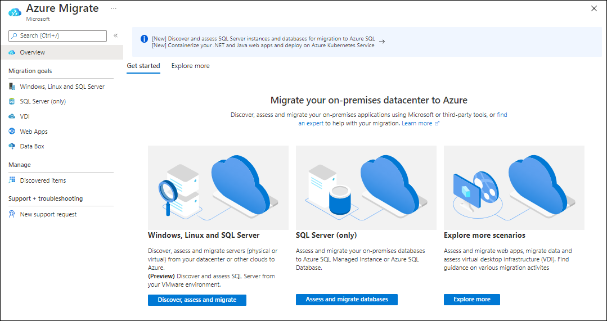
3. Select **Discover, assess and migrate**, then **Create project**.  Select your subscription and create a new resource group named **RHELAzureMigrateRG**. Enter **CovidVaccineMigration** as the Migrate project name and choose a geography close to you to store migration assessment data. Then select **Create**.
>**Note**: If you are running this lab in a shared subscription you will need to use a migrate project name that is unique in the subscription. Append characters to the end of migrate project name to make your project name unique. For example: **CovidVaccineMigration1234**.
   environment. This appliance communicates with the RHEL server to gather configuration and performance data about your on-premises VMs and returns that data to your Azure Migrate project.
1. In the normal course of considering migration, you would perform an assessment of all assets to be moved. For the purposes of this workshop, we are assuming the assessment was completed, and the decision taken to move the existing server structure from on-premises to Azure without change. 
The most common options for migration are:
•	Lift and shift – migrating existing services, applications, and servers without any changes to architecture.
•	Lift and shift, then modernize – Snapshot the existing on-premises architecture on Azure, then invest the time and thought into transforming your services, applications, and servers with expanded Azure offerings.
•	Modernize, then move – Invest the time and effort to transform existing architecture prior to migrating to Azure.

2. Under **Azure Migrate: Server Migration**, select **Discover** to open the **Discover machines** blade. Under **Are your machines virtualized?**, select **Yes, with VMWare vSphere Hypervisor**.
  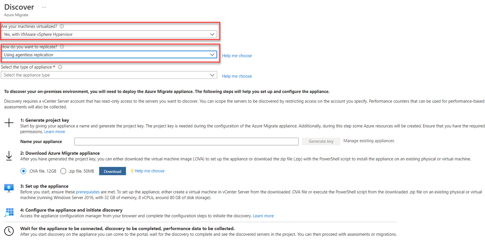
•	Note: To run an assessment, click Discover in the Assessment Tools box. Assessments run over a period, such as a week or a month, to gather as much performance and dependency data as possible, therefore, we do not run it here. Consider an assessment and a carefully thought-out migration plan to be prerequisites to actual migration.
3.  In **1: Generate Azure Migrate project key**, provide **CovidDataAppl** as name for the Azure Migrate appliance that you will set up for discovery of your VMs. 
Select **Generate key** to start the creation of the required Azure resources. 
    
>**Note**: If you are running this lab in a shared Azure Migrate project, you will need to provide an appliance name that is unique in the project. Append characters to the end of appliance name to make your appliance name unique. For example: **CovidDataAppl123**.
4.  **Wait** for the key to be generated, then copy the **Azure Migrate project key** to your clipboard.

    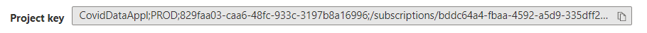

5.  Read through the instructions on how to download, deploy, and configure the Azure Migrate appliance. Close the 'Discover machines' blade (do **not** download the .OVA file or .ZIP file, they have already been downloaded and deployed for you).

6.  Deployment methods.
The appliance can be deployed using a couple of methods:
	The appliance can be deployed using a template for servers running in VMware or Hyper-V environment (OVA template for VMware or VHD for Hyper-V).
	If you don't want to use a template, you can deploy the appliance for VMware or Hyper-V environment using a PowerShell installer script.
	In Azure Government, you should deploy the appliance using a PowerShell installer script. Refer to the steps of deployment here.
	For physical or virtualized servers on-premises or any other cloud, you always deploy the appliance using a PowerShell installer script.Refer to the steps of deployment here.
	Download links are available in the tables below.
7.  Appliance – Vmware
|Requirements| VMware|
|---------------------------------|-----------------------------------------------------------------------------------------------------|
|Permissions| To access the appliance configuration manager locally or remotely,you need to have a local or domain user account with administrative privileges on the appliance server.|
|Appliance services| The appliance has the following services:

- Appliance configuration manager: This is a web application which can be configured with source details to start the discovery and assessment of servers.
- VMware discovery agent: The agent collects server configuration metadata which can be used to create as on-premises assessments.
- VMware assessment agent: The agent collects server performance metadata which can be used to create performance-based assessments.
- Auto update service: The service keeps all the agents running on the appliance up-to-date. It automatically runs once every 24 hours.
- DRA agent: Orchestrates server replication, and coordinates communication between replicated servers and Azure. Used only when replicating servers to Azure using agentless migration.
- Gateway: Sends replicated data to Azure. Used only when replicating servers to Azure using agentless migration.
- SQL discovery and assessment agent: sends the configuration and performance metadata of SQL Server instances and databases to Azure.|
|Project limits| An appliance can only be registered with a single project.
A single project can have multiple registered appliances.|
|Discovery limits| An appliance can discover up to 10,000 servers running on a vCenter Server.
An appliance can connect to a single vCenter Server.|
|Supported deployment|Deploy as new server running on vCenter Server using OVA template.

Deploy on an existing server running Windows Server 2016 using PowerShell installer script.|
|OVE template| Download from project or from [here]( https://go.microsoft.com/fwlink/?linkid=2140333)

Download size is 11.9 GB.

The downloaded appliance template comes with a Windows Server 2016 evaluation license, which is valid for 180 days.
If the evaluation period is close to expiry, we recommend that you download and deploy a new appliance using OVA template , or you activate the operating system license of the appliance server.|
|OVA verification|[Verify]( https://docs.microsoft.com/en-us/azure/migrate/tutorial-discover-vmware#verify-security) the OVA template downloaded from project by checking the hash values.|
|PowerShell scripts| Refer to this [article]( https://docs.microsoft.com/en-us/azure/migrate/deploy-appliance-script#set-up-the-appliance-for-vmware) on how to deploy an appliance using the PowerShell installer script.|
|Hardware and network requirements|The appliance should run on server with Windows Server 2016, 32-GB RAM, 8 vCPUs, around 80 GB of disk storage, and an external virtual switch.
The appliance requires internet access, either directly or through a proxy.

If you deploy the appliance using OVA template, you need enough resources on the vCenter Server to create a server that meets the hardware requirements.

If you run the appliance on an existing server, make sure that it's running Windows Server 2016, and meets hardware requirements.
(Currently the deployment of appliance is only supported on Windows Server 2016.)|
|VMware requirements|If you deploy the appliance as a server on vCenter Server, it must be deployed on a vCenter Server running 5.5, 6.0, 6.5, or 6.7 and an ESXi host running version 5.5 or later.|
|VDDK (agentless migration)|To leverage the appliance for agentless migration of servers, the VMware vSphere VDDK must be installed on the appliance server.|

8.  In vSphere Client, right-click the appliance server, and then select **Open Console**.
9.  Select or enter the language, time zone, and password for the appliance.
10.  Open a browser on any server that can connect to the appliance server. Then, open the URL of the appliance configuration manager: **https://appliance name or IP address: 44368**.
Or you can open the configuration manager from the appliance server desktop by selecting the shortcut for the configuration manager.
11.  Accept the license terms and read the third-party information.
12.  In the configuration manager, select **Set up prerequisites**, and then complete these steps:
a.	**Connectivity**: The appliance checks that the server has internet access. If the server uses a proxy:
1.	Select **Setup proxy** to specify the proxy address (in the form http://ProxyIPAddress or http://ProxyFQDN, where FQDN refers to a fully qualified domain name) and listening port.
2.	Enter credentials if the proxy needs authentication.
3.	If you have added proxy details or disabled the proxy or authentication, select **Save** to trigger connectivity and check connectivity again. Only HTTP proxy is supported.
b.	**Time sync**: Check that the time on the appliance is in sync with internet time for discovery to work properly.
c.	**Install updates**: The appliance ensures that the latest updates are installed. When the check is finished, you can select **View appliance services** to see the status and versions of the services running on the appliance server.
d.	**Install the VDDK**: The appliance checks that VMware vSphere Virtual Disk Development Kit (VDDK) is installed. If the VDDK isn't installed, download VDDK 6.7 from VMware. Extract the downloaded zip file contents to the specified location on the appliance, as indicated in the Installation instructions.
Azure Migrate Server Migration uses the VDDK to replicate servers during migration to Azure.
e.	You can rerun prerequisites at any time during appliance configuration to check whether the appliance meets all the prerequisites:
    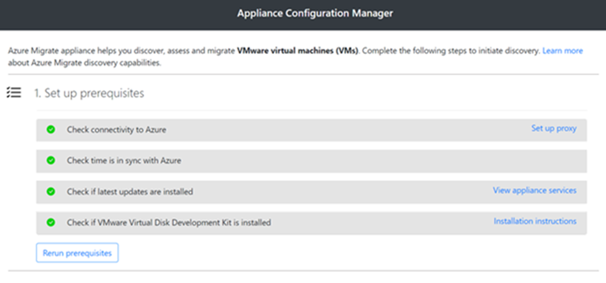
13.  Register the appliance with Azure Migrate
a.	Paste the project key that you copied from the portal. If you don't have the key, go to **Discovery and assessment**>**Discover**>**Manage existing appliances**. Select the appliance name you provided when you generated the project key, and then copy the key that's shown.
b.	You must have a device code to authenticate with Azure. Select **Login**. In **Continue with Azure Login**, select **Copy code & Login** to copy the device code and open an Azure Login prompt in a new browser tab. Make sure you've disabled the pop-up blocker in the browser to see the prompt.
    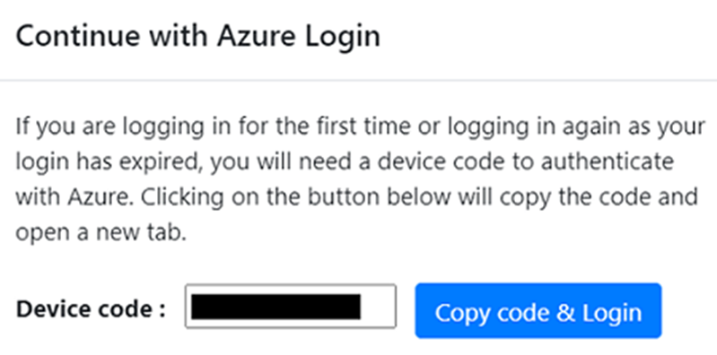
c.	In a new tab in your browser, paste the device code and sign in by using your Azure username and password.
d.	After you successfully log in, return to the browser tab that displays the appliance configuration manager. If the Azure user account that you used to log in has the required permissions for the Azure resources that were created during key generation, appliance registration starts.
e.	After the appliance is successfully registered, to see the registration details, select **View details**.
    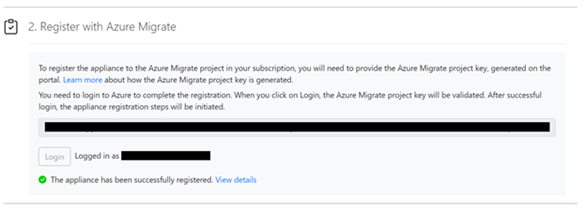

## Task summary <!-- omit in toc -->
In this task you connected to an Azure Migrate appliance and registered the appliance with Azure Migrate.

### Task 3: Migrate a server with Azure Migrate
In this task, you will migrate the on-premises Red Hat Enterprise Linux (RHEL) host server using Azure Migrate.
1.  In the Azure Migrate tab, click **Replicate** in the Azure Migrate: Server Migration box.
    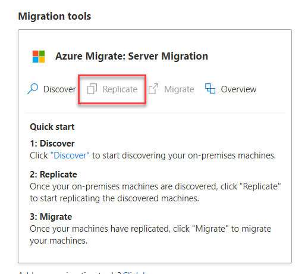
2.  The Azure Migrate: Server Migration page opens on a series of steps. 
    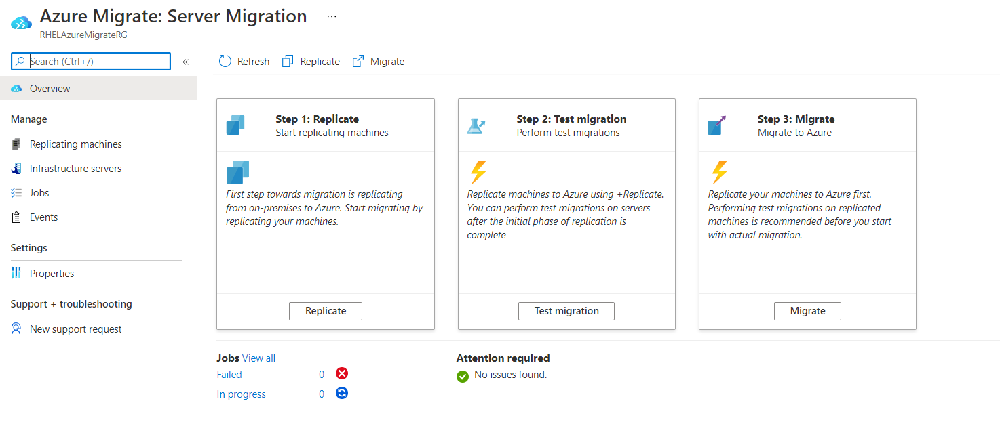
3.  Begin replication. Click **Replicate**. Select the type of virtualization on your server – Vmware vSphere, in this case.
4.  Select the On-premises appliance you registered in the previous task.

    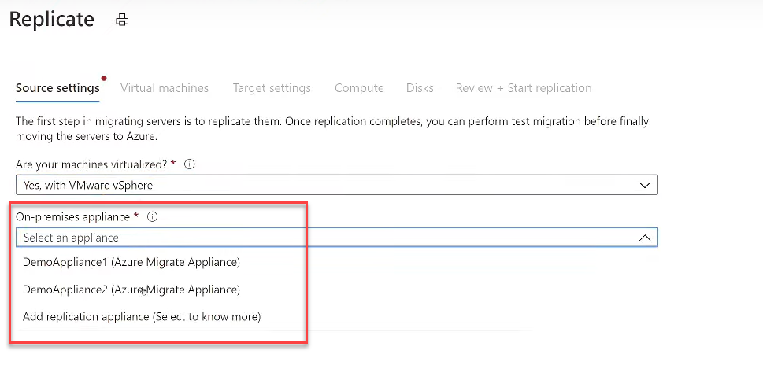
5.  Select the **Virtual machines** tab and specify the VMs to migrate. In the **Target settings** tab, you can change the specifications of the destination server. Look through the **Compute** and **Disks** tab, then finally, select **Review + Start replication**.
6.  Replication begin. Within a few minutes, the main Azure Migrate page will update with your server information.
    

7. Click on **Replicating servers**.
    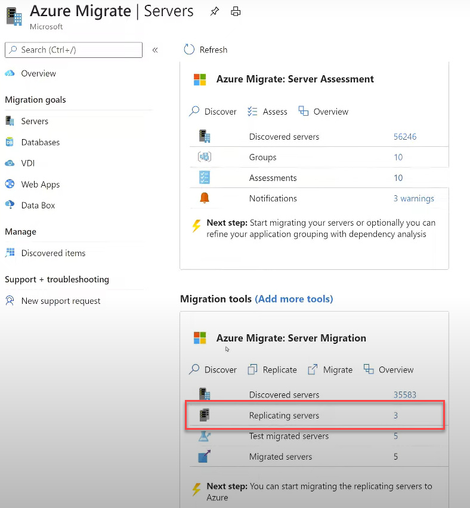
8. The Azure Migrate: Server Migration | Replicating machines window opens. Select the **Azure Migrate appliance** tab to view the details of your server migration. The Other tab would display replication status for servers using agented replication.
    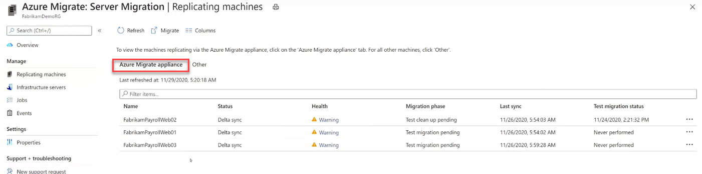

9. When your server replication has completed, select the three dots on the far-right hand side. A drop-down box opens offering additional information and action options, including performing a test migration or a full migration. Outside of the workshop environment, you would always opt to perform a test migration first. For the purposes of the workshop, however, select **Migrate**.

    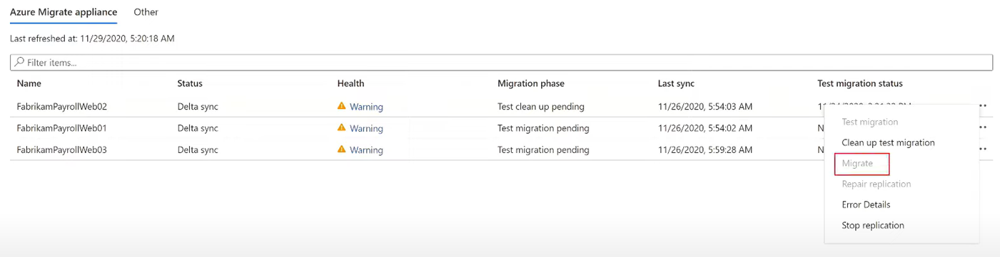

10.  Outside of this workshop, after your test migration succeeded, you would shut down your on-premises server, begin the actual migration and allow the service to grab a final snapshot. Migration is complete when you start up your server in Azure.

#### Task summary <!-- omit in toc -->
In this task you migrated an on-premises RedHat Enterprise Linux server containing a JBoss EAP application running on three virtual machines.

### Task 4: Post-migration steps

There are post-migration steps that should be completed before the migrated services is ready for production use. These include:

- Installing the Azure VM Agent

- Cleaning up migration resources

- Enabling backup and disaster recovery

- Encrypting VM disks

- Ensuring the network is properly secured

- Ensuring proper subscription governance is in place, such as role-based access control and Azure Policy

- Reviewing recommendations from Azure Advisor and Security Center

In this task you will install the Azure Virtual Machine Agent (VM Agent) on your migrated Azure VMs and clean up any migration resources. The remaining steps are common for any Azure application, not just migrations, and are therefore out of scope for this hands-on lab.

> **Note**: The Microsoft Azure Virtual Machine Agent (VM Agent) is a secure, lightweight process that manages virtual machine (VM) interaction with the Azure Fabric Controller. The VM Agent has a primary role in enabling and executing Azure virtual machine extensions. VM Extensions enable post-deployment configuration of VM, such as installing and configuring software. VM extensions also enable recovery features such as resetting the administrative password of a VM. Without the Azure VM Agent, VM extensions cannot be used.
>
> In this lab, you will install the VM agent on the Azure VMs after migration. Alternatively, you could instead install the agent on the VMs in RHEL before migration.

1. In the Azure portal, locate the **CovidVaccineDataweb1** VM and open a remote desktop session using Azure Bastion. Log in to the **Administrator** account using password **demo!pass123** (use the 'eyeball' to check the password was entered correctly with your local keyboard mapping).

2. Open a web browser and download the VM Agent from:

    ```s
    https://go.microsoft.com/fwlink/?LinkID=394789
    ```

    **Note**: You may need to open the clipboard panel on the left-hand edge of the Bastion window, paste the URL, and then paste into the VM.

3. After the installer has downloaded, run it. Select **Next**, Select **I accept the terms in the License Agreement**, and then **Next** again. Select **Finish**.

    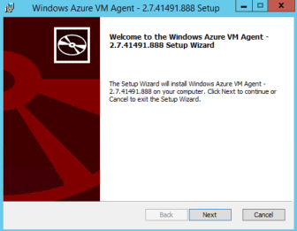

4. Close the CovidVaccineDataweb1 window. Repeat the Azure VM agent installation process on the remaining VMs.

You will now install the Linux version of the Azure VM Agent on the Nginx VM. All Linux distributions supports by Azure have integrated the Azure VM Agent into their software repositories, making installation easy in most cases.

5. In the Azure portal, locate the **RHEL Nginx** VM and **Connect** to the VM using Azure Bastion, with the user name **demouser** and password **demo!pass123**. Since this is a Linux VM, Bastion will create an SSH session. You may need to enter the credentials again. 

6. In the SSH session, enter the following command:

    ```s
    sudo apt-get install walinuxagent
    ```

    When prompted, enter the password **demo!pass123**. At the *Do you want to continue?* prompt, type **Y** and press **Enter**.

    **Note**: You may need to open the clipboard panel on the left-hand edge of the Bastion window, paste the command, and then paste into the VM.

7. Wait for the installer to finish, then close the terminal window and the VM window.

To demonstrate that the VM Agent is installed, we will now execute the 'Run command' feature from the Azure portal. For more information on the VM Agent, see [Windows VM Agent](https://docs.microsoft.com/azure/virtual-machines/extensions/agent-windows) and [Linux VM Agent](https://docs.microsoft.com/azure/virtual-machines/extensions/agent-linux).

8. Navigate to the **CovidVaccineDataweb1** blade. Under **Operations**, select **Run command**, followed by **IPConfig**, followed by **Run**. After a few seconds, you should see the output of the IPConfig command.

    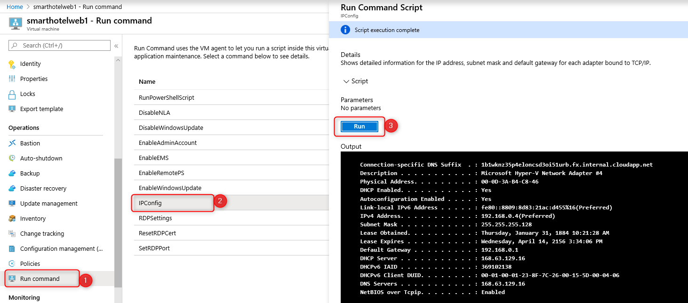

9. As a final step, you will now clean up the resources that were created to support the migration and are no longer needed.

    Because the temporary resources have been deployed to a separate ** RHELAzureMigrateRG** resource group, deleting them is as simple as deleting the resource group. Simply navigate to the resource group blade in the Azure portal, select **Delete resource group** and complete the confirmation prompts.

#### Task summary <!-- omit in toc -->

In this task you installed the Azure Virtual Machine Agent (VM Agent) on your migrated VMs. You also cleaned up the temporary resources created during the migration process.

### Exercise summary <!-- omit in toc -->

In this exercise you migrated the web tier and application tiers of the application from on-premises to Azure using Azure Migrate: Server Migration. You also installed the VM Agent on the migrated virtual machines, and cleaned up migration resources.

## After the hands-on lab

Duration: 10 minutes

### Task 1: Clean up resources

You should complete these steps *after* attending the Hands-on lab. Failure to delete the resources created during the lab will result in continued billing.

1. Delete the **RedHatMigration** resource group containing the CovidVaccineDataHost.

You should follow all steps provided *after* attending the Hands-on lab.
