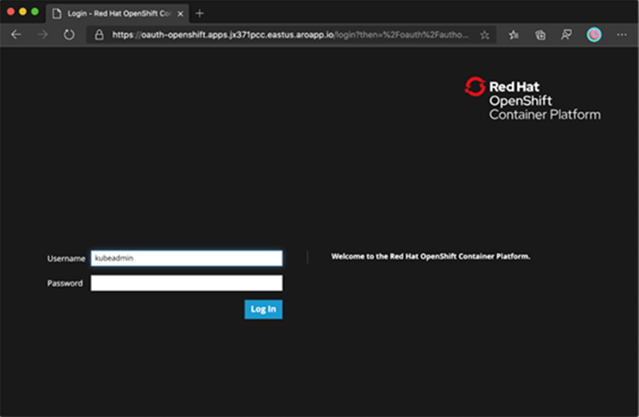
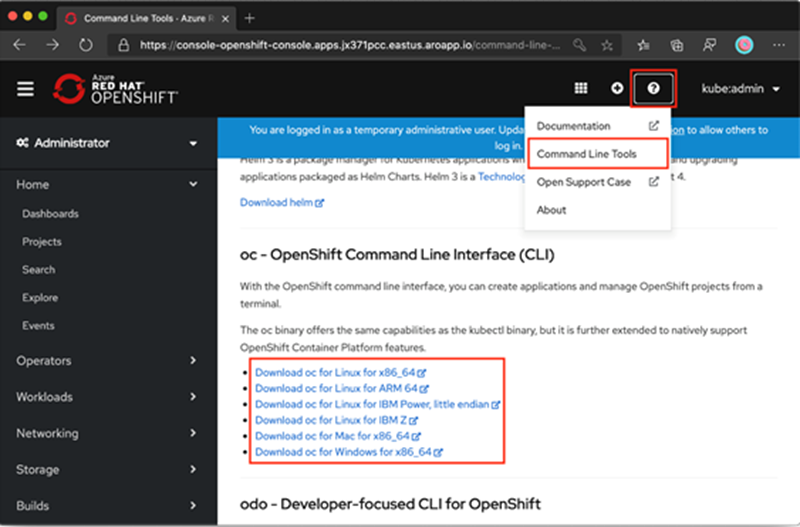

Modernize-with-Red-Hat-JBoss-EAP-for-OpenShift-on-Azure

Modernize with Red Hat JBoss EAP for OpenShift on Azure hands-on lab step-by-step 

Hands-on lab step-by-step

April 2021

Information in this document, including URL and other Internet Web site references, is subject to change without notice. Unless otherwise noted, the example companies, organizations, products, domain names, e-mail addresses, logos, people, places, and events depicted herein are fictitious, and no association with any real company, organization, product, domain name, e-mail address, logo, person, place, or event is intended or should be inferred. Complying with all applicable copyright laws is the responsibility of the user. Without limiting the rights under copyright, no part of this document may be reproduced, stored in, or introduced into a retrieval system, or transmitted in any form or by any means (electronic, mechanical, photocopying, recording, or otherwise), or for any purpose, without the express written permission of Microsoft Corporation.

Microsoft may have patents, patent applications, trademarks, copyrights, or other intellectual property rights covering subject matter in this document. Except as expressly provided in any written license agreement from Microsoft, the furnishing of this document does not give you any license to these patents, trademarks, copyrights, or other intellectual property.

The names of manufacturers, products, or URLs are provided for informational purposes only and Microsoft makes no representations and warranties, either expressed, implied, or statutory, regarding these manufacturers or the use of the products with any Microsoft technologies. The inclusion of a manufacturer or product does not imply endorsement of Microsoft of the manufacturer or product. Links may be provided to third party sites. Such sites are not under the control of Microsoft and Microsoft is not responsible for the contents of any linked site or any link contained in a linked site, or any changes or updates to such sites. Microsoft is not responsible for webcasting or any other form of transmission received from any linked site. Microsoft is providing these links to you only as a convenience, and the inclusion of any link does not imply endorsement of Microsoft of the site, or the products contained therein.

© 2021 Microsoft Corporation. All rights reserved.

Microsoft and the trademarks listed at <https://www.microsoft.com/en-us/legal/intellectualproperty/Trademarks/Usage/General.aspx> are trademarks of the Microsoft group of companies. All other trademarks are property of their respective owners.

**Contents** 

<!-- TOC -->

- [Modernize with Red Hat JBoss EAP for OpenShift on Azure hands-on lab step-by-step](#Modernize-with-Red-Hat-JBoss-EAP-for-OpenShift-on-Azure-hands-on-lab-step-by-step)
  - [Abstract and learning objectives](#abstract-and-learning-objectives)
  - [Overview](#overview)
  - [Requirements](#requirements)
  - [Before the hands-on lab](#before-the-hands-on-lab)
  - [Exercise 1: Install OpenShift(#install-openshift)
   - [Task 1: Install OpenShift(#install-openshift)
   - [Task 2: Prepare a custom domain for your cluster(#prepare-a-custom-domain-for-your-cluster)
   - [Task 3: Create a virtual network containing two empty subnets(#create-a-virtual-network-containing-two-empty-subnets)
   - [Task 4: Create the cluster(#create-the-cluster)
  - [Exercise 2: Connect to an Azure Red Hat OpenShift 4 Cluster(#connect-to-an-azure-red-hat-openshift-4-cluster)
   - [Task 1: Connect to an Azure Red Hat OpenShift 4 Cluster(#connect-to-an-azure-red-hat-openshift-4-cluster)
   - [Task 2: Install the OpenShift CLI(#install-the-openshift-cli)
   - [Task 3: Connect using the OpenShift CLI(#connect-using-the-openshift-cli)
  - [Exercise 3: Modernize and migrate(#modernize-and-migrate)
   - [Task 1: Install Red Hat JBoss EAP for OpenShift(#install-red-hat-jboss-eap-for-openshift)
   - [Task 2: JBoss EAP Prepare OpenShift for Application Deployment(#jboss-eap-prepare-openshift-for-application-deployment)
   - [Task 3: JBoss EAP Prepare OpenShift for Application Deployment(#jboss-eap-prepare-openshift-for-application-deployment)
   - [Task 4: Configure the JBoss EAP for OpenShift Image for your Java Application(#configure-the-jboss-eap-for-openshift-image-for-your-java-application)
   - [Task 5: Build Extensions and Project Artifacts(#build-extensions-and-project-artifacts)
   - [Task 6: Migrate data(#migrate-data)
  - [Exercise 4: Use Java/JDBC to create and connect to Azure Database for PostgreSQL(#use-java/jdbc-to-create-and-connect-to-azure-database-for-postgresql)
   - [Task 1: Prepare the working environment(#prepare-the-working-environment)
   - [Task 2: Create an Azure Database for PostgreSQL instance(#create-an-azure-database-for-postgresql)
   - [Task 3: Code the application and connect to the database(#code-the-application-and-connect-to-the-database)
  - [After the hands-on lab](#after-the-hands-on-lab)
   - [Task 1: Clean up resources](#task-1-clean-up-resources)
<!-- /TOC -->

# Modernize with Red Hat JBoss EAP for OpenShift on Azure hands-on lab step-by-step

## Abstract and learning objectives 

In this hands-on lab, you will modernize the JBoss EAP application on Red Hat Enterprise Linux (RHEL) that you migrated in the previous workshop. You will install and configure Azure Red Hat OpenShift (ARO). You will also install JBoss EAP for Azure Red Hat OpenShift. Finally, you will attach a PostgreSQL database to your app with Java and JDBC.

After this hands-on lab, you will understand the ease of modernizing applications with Red Hat OpenShift, JBoss EAP, and PostgreSQL on Azure. 

## Overview
Before this lab, you will have migrated a server and virtual machines running JBoss EAP and Red Hat Enterprise Linux from on-premises to Azure. 

During the lab, you will modernize this application stack to run on containers on Azure Red Hat Openshift. This will include attaching a PostgreSQL server to the application.
## Solution architecture
The starting architecture is as follows: Covid Vaccine Data application comprises 3 Virtual Machines hosted in Red Hat Enterprise Linux running on Azure.

- **WebApp** Hosted on the CovidVaccineDataHost running JBoss EAP on a Red Hat Enterprise Linux 7.3 server.

- **Server** Hosted on the CovidVaccineDataHost on Red Hat Enterprise Linux 7.3 server.

- **Web proxy** Hosted on the Red Hat Enterprise Linux VM running Nginx on RHEL 7.3.

For simplicity, there is no redundancy in any of the tiers.

## Exercise 1: Install OpenShift
### Task 1: Install OpenShift
Before you begin:
If you choose to install and use the CLI locally, this tutorial requires that you run Azure CLI version 2.6.0 or later. Run `az –version` to find the version. If you need to install or upgrade, see [Install Azure CLI]( https://docs.microsoft.com/en-us/cli/azure/install-azure-cli).
Azure Red Hat OpenShift requires a minimum of 40 cores to create and run an OpenShift cluster. The default Azure resource quota for a new Azure subscription does not meet this requirement. To request an increase in your resource limit, see [Standard quota: Increase limits by VM series](https://docs.microsoft.com/en-us/azure/azure-portal/supportability/per-vm-quota-requests).
ARO pull secret does not change the cost of the RH OpenShift license for ARO.
1.	Verify your permissions.
a.	During this tutorial, you will create a resource group, which will contain the virtual network for the cluster. You must have either Contributor and User Access Administrator permissions, or Owner permissions, either directly on the virtual network, or on the resource group or subscription containing it.
b.	You will also need sufficient Azure Active Directory permissions for the tooling to create an application and service principal on your behalf for the cluster.
2.	Register the resource providers.
a.	If you have multiple Azure subscriptions, specify the relevant subscription ID:
b.	Azure CLICopy
i.	Try It
ii.	`az account set --subscription <SUBSCRIPTION ID>`
c.	Register the Microsoft.RedHatOpenShift resource provider:
d.	Azure CLICopy
i.	Try It
ii.	`az provider register -n Microsoft.RedHatOpenShift` --wait
e.	Register the Microsoft.Compute resource provider:
f.	Azure CLICopy
i.	Try It
ii.	`az provider register -n Microsoft.Compute` --wait
3.	Register the Microsoft.Storage resource provider:
a.	Azure CLICopy
i.	Try It
ii.	`az provider register -n Microsoft.Storage` --wait
4.	Register the Microsoft.Authorization resource provider:
a.	Azure CLICopy
i.	Try It
ii.	`az provider register -n Microsoft.Authorization` –wait
5.	Get a Red Hat pull secret (optional).
A Red Hat pull secret enables your cluster to access Red Hat container registries along with additional content. This step is optional but recommended.
[Navigate to your Red Hat OpenShift cluster manager portal](https://cloud.redhat.com/openshift/install/azure/aro-provisioned) and log in.
You will need to log in to your Red Hat account or create a new Red Hat account with your business email and accept the terms and conditions.
1.	Click **Download pull secret** and download a pull secret to be used with your ARO cluster.
Keep the saved pull-secret.txt file somewhere safe. The file will be used in each cluster creation if you need to create a cluster that includes samples or operators for Red Hat or certified partners.
When running the `az aro create` command, you can reference your pull secret using the--pull-secret @pull-secret.txt parameter. Execute `az aro create` from the directory where you stored your pull-secret.txt file. Otherwise, replace @pull-secret.txt with @/path/to/my/pull-secret.txt.
If you are copying your pull secret or referencing it in other scripts, your pull secret should be formatted as a valid JSON string.
### Task 2: Prepare a custom domain for your cluster (optional)
When running the `az aro create` command, you can specify a custom domain for your cluster by using the --domain `foo.example.com parameter`.
If you provide a custom domain for your cluster note the following points:
•	After creating your cluster, you must create 2 DNS A records in your DNS server for the -–domain specified:
o	**api** - pointing to the api server IP address
o	**/*/.apps**- pointing to the ingress IP address
o	Retrieve these values by executing the following command after cluster creation: `az aro show -n -g --query '{api:apiserverProfile.ip, ingress:ingressProfiles[0].ip}'`.
•	The OpenShift console will be available at a URL such as https://console-openshift-console.apps.example.com, instead of the built-in domain https://console-openshift-console.apps.<random>.<location>.aroapp.io.
•	By default, OpenShift uses self-signed certificates for all routes created on custom domains *.apps.example.com. If you choose to use custom DNS after connecting to the cluster, you will need to follow the OpenShift documentation to []configure a custom CA for your ingress controller](https://docs.openshift.com/container-platform/4.6/security/certificates/replacing-default-ingress-certificate.html) and a [custom CA for your API server](https://docs.openshift.com/container-platform/4.6/security/certificates/api-server.html).
### Task 3: Create a virtual network containing two empty subnets.
Next, you will create a virtual network containing two empty subnets. If you have existing virtual network that meets your needs, you can skip this step.
1.	Set the following variables in the shell environment in which you will execute the az commands.
‘ConsoleCopy
LOCATION=eastus                 # the location of your cluster
RESOURCEGROUP=aro-rg            # the name of the resource group where you want to create your cluster
CLUSTER=cluster                 # the name of your cluster`
2.	Create a resource group.
An Azure resource group is a logical group in which Azure resources are deployed and managed. When you create a resource group, you are asked to specify a location. This location is where resource group metadata is stored, and it is also where your resources run in Azure if you don't specify another region during resource creation. Create a resource group using the [az group create](https://docs.microsoft.com/en-us/cli/azure/group#az_group_create) command.
>Note: Azure Red Hat OpenShift is not available in all regions where an Azure resource group can be created. See [Available regions](https://azure.microsoft.com/en-gb/global-infrastructure/services/?products=openshift) for information on where Azure Red Hat OpenShift is supported.
Azure CLICopy
Try It
`az group create \
  --name $RESOURCEGROUP \
  --location $LOCATION`
The following example output shows the resource group created successfully:
JSONCopy
`{
  "id": "/subscriptions/<guid>/resourceGroups/aro-rg",
  "location": "eastus",
  "name": "aro-rg",
  "properties": {
    "provisioningState": "Succeeded"
  },
  "type": "Microsoft.Resources/resourceGroups"
}`
3.	Create a virtual network.
Azure Red Hat OpenShift clusters running OpenShift 4 require a virtual network with two empty subnets, for the master and worker nodes. You can either create a new virtual network for this or use an existing virtual network.
Create a new virtual network in the same resource group you created earlier:
Azure CLICopy
Try It
`az network vnet create \
   --resource-group $RESOURCEGROUP \
   --name aro-vnet \
   --address-prefixes 10.0.0.0/22`
The following example output shows the virtual network created successfully:
JSONCopy
`{
  "newVNet": {
    "addressSpace": {
      "addressPrefixes": [
        "10.0.0.0/22"
      ]
    },
    "dhcpOptions": {
      "dnsServers": []
    },
    "id": "/subscriptions/<guid>/resourceGroups/aro-rg/providers/Microsoft.Network/virtualNetworks/aro-vnet",
    "location": "eastus",
    "name": "aro-vnet",
    "provisioningState": "Succeeded",
    "resourceGroup": "aro-rg",
    "type": "Microsoft.Network/virtualNetworks"
  }
}`
4.	Add an empty subnet for the master nodes.
Azure CLICopy
Try It
`az network vnet subnet create \
  --resource-group $RESOURCEGROUP \
  --vnet-name aro-vnet \
  --name master-subnet \
  --address-prefixes 10.0.0.0/23 \
  --service-endpoints Microsoft.ContainerRegistry`
5.	Add an empty subnet for the worker nodes.
Azure CLICopy
Try It
`az network vnet subnet create \
  --resource-group $RESOURCEGROUP \
  --vnet-name aro-vnet \
  --name worker-subnet \
  --address-prefixes 10.0.2.0/23 \
  --service-endpoints Microsoft.ContainerRegistry`
6.	[Disable subnet private endpoint policies](https://docs.microsoft.com/en-us/azure/private-link/disable-private-link-service-network-policy) **on the master subnet**. This is required for the service to be able to connect to and manage private clusters. For more information on [controlling egress traffic on your ARO cluster, refer to the documentation](Restrict egress traffic in an Azure Red Hat OpenShift (ARO) cluster | Microsoft Docs).
Azure CLICopy
Try It
`az network vnet subnet update \
  --name master-subnet \
  --resource-group $RESOURCEGROUP \
  --vnet-name aro-vnet \
  --disable-private-link-service-network-policies true`
### Task 4: Create the cluster
Run the following command to create a cluster. If you choose to use either of the following options, modify the command accordingly:
	Optionally, you can [pass your Red Hat pull secret](https://docs.microsoft.com/en-us/azure/openshift/tutorial-create-cluster#get-a-red-hat-pull-secret-optional) which enables your cluster to access Red Hat container registries along with additional content. Add the --pull-secret @pull-secret.txt argument to your command.
	Optionally, you can [use a custom domain](https://docs.microsoft.com/en-us/azure/openshift/tutorial-create-cluster#prepare-a-custom-domain-for-your-cluster-optional). Add the --domain foo.example.com argument to your command, replacing foo.example.com with your own custom domain.

>Note: If you are adding any optional arguments to your command, be sure to close the argument on the preceding line of the command with a trailing backslash.

Azure CLICopy
Try It

`az aro create \
  --resource-group $RESOURCEGROUP \
  --name $CLUSTER \
  --vnet aro-vnet \
  --master-subnet master-subnet \
  --worker-subnet worker-subnet`
After executing the az aro create command, it normally takes about 35 minutes to create a cluster.
## Exercise summary <!-- omit in toc -->
In this part of the tutorial, you learned how to:
	Install OpenShift.
	Prepare a custom domain for your cluster.
	Create a virtual network containing two empty subnets.
	Create the cluster.

## Exercise 2: Connect to an Azure Red Hat OpenShift 4 Cluster.
Before you begin:
In the previous task, you created an Azure Red Hat OpenShift cluster. In this exercise, you will connect to the cluster.
### Task 1: Connect to an Azure Red Hat OpenShift 4 Cluster.
You can log into the cluster using the kubeadmin user. Run the following command to find the password for the kubeadmin user.
Azure CLICopy
Try It
`az aro list-credentials \
  --name $CLUSTER \
  --resource-group $RESOURCEGROUP`
The following example output shows what the password will be in kubeadminPassword.
JSONCopy
`{
  "kubeadminPassword": "<generated password>",
  "kubeadminUsername": "kubeadmin"
}`
You can find the cluster console URL by running the following command, which will look like https://console-openshift-console.apps.<random>.<region>.aroapp.io/.
Azure CLICopy
Try It
`az aro show \
    --name $CLUSTER \
    --resource-group $RESOURCEGROUP \
    --query "consoleProfile.url" -o tsv`
Launch the console URL in a browser and login using the kubeadmin credentials.
    
### Task 2: Install the OpenShift CLI.
Once you're logged into the OpenShift Web Console, click on the **?** on the top right and then on **Command Line Tools**. Download the release appropriate to your machine.
    
You can also download the latest release of the CLI appropriate to your machine from [OpenShift.com](https://mirror.openshift.com/pub/openshift-v4/clients/ocp/latest/).
If you're running the commands on the Azure Cloud Shell, download the latest OpenShift 4 CLI for Linux.
Azure CLICopy
Try It
`cd ~
wget https://mirror.openshift.com/pub/openshift-v4/clients/ocp/latest/openshift-client-linux.tar.gz`

`mkdir openshift
tar -zxvf openshift-client-linux.tar.gz -C openshift
echo 'export PATH=$PATH:~/openshift' >> ~/.bashrc && source ~/.bashrc`

### Task 3: Connect using the OpenShift CLI.
Retrieve the API server's address.
Azure CLICopy
Try It
`apiServer=$(az aro show -g $RESOURCEGROUP -n $CLUSTER --query apiserverProfile.url -o tsv)`
Login to the OpenShift cluster's API server using the following command. Replace **<kubeadmin password>** with the password you just retrieved.
Azure CLICopy
Try It
`oc login $apiServer -u kubeadmin -p <kubeadmin password>`

## Exercise summary <!-- omit in toc -->
In this part of the tutorial, you learned how to:
	Obtain kubeadmin credentials for your cluster.
	Install the OpenShift CLI.
	Connect to an Azure Red Hat OpenShift cluster using the OpenShift CLI.

## Exercise 3: Modernize and migrate
What is modernizing: Breaking a monolithic application stack into microservices running in containers on the cloud.

Why modernize and microservices: Breaking your systems into smaller pieces allows for greater parallelization and autonomy and reduces time to value. 

### Task 1: Install Red Hat JBoss EAP for OpenShift
Red Hat offers a containerized image for JBoss EAP that is designed for use with OpenShift. Using this image, developers can quickly and easily build, scale, and test applications that are deployed across hybrid environments.
There are some notable differences when comparing the JBoss EAP product with the JBoss EAP for OpenShift image. The following table describes these differences and notes which features are included or supported in the current version of JBoss EAP for OpenShift.
**Differences between JBoss EAP and JBoss EAP for OpenShift**
|JBoss EAP Feature| Status in JBoss EAP for OpenShift| Description|
|-----------------------|----------------------|-------------------------------------------------------------------------------|
|JBoss EAP management console| Not included| The JBoss EAP management console is not include din this release of JBoss EAP for OpenShift.|
|JBoss EAP management CLI| Not recommended| The JBoss EAP management CLI is not recommended for use with JBoss EAP running in a containerized environment. Any configuration changes made using the management CLI in a running container will be lost when the container restarts. [The management CLI is accessible from within a pod for troubleshooting purposes].(https://access.redhat.com/documentation/en-us/red_hat_jboss_enterprise_application_platform/7.1/html/red_hat_jboss_enterprise_application_platform_for_openshift/troubleshooting#troubleshooting_management_cli)|
|Managed domain| Not supported| Although a JBoss EAP managed domain is not supported, creation and distribution of applications are managed in the containers on OpenShift.|
|Default root page| Disabled| The default root page is disabled, but you can deploy your own application to the root context as `ROOT.war`.|
|Remote messaging| Supported| ActiveMQ Artemis for inter-pod and remote messaging is supported. HornetQ is only supported for intra-pod messaging and only enabled when ActiveMQ Artemis is absent. JBoss EAP for OpenShift 7 includes ActiveMQ Artemis as a replacement for HornetQ.|
|Transaction recovery| Partially supported| There are some [unsupported transaction recovery scenarios and caveats]( https://access.redhat.com/documentation/en-us/red_hat_jboss_enterprise_application_platform/7.1/html/red_hat_jboss_enterprise_application_platform_for_openshift/reference_information#reference_transactions) when undertaking transaction recovery with the JBoss EAP for OpenShift image.|

### Task 2: JBoss EAP Prepare OpenShift for Application Deployment.
This workflow assumes that you already have an OpenShift instance installed and operational. 
Prepare OpenShift for Application Deployment.
1.	Log in to your OpenShift instance using the `oc login` command.
2.	Create a new project in OpenShift.
A project allows a group of users to organize and manage content separately from other groups. You can create a project in OpenShift using the following command.
`$ oc new-project *PROJECT_NAME*`
For example, for the `kitchensink` quickstart, create a new project named `eap-demo` using the following command.
`$ oc new-project eap-demo`
3.	Create a keystore.
JBoss EAP for OpenShift requires a keystore to be imported to properly install and configure the image on your OpenShift instance.
**Warning**
The following commands generate a self-signed certificate, but for production environments Red Hat recommends that you use your own SSL certificate purchased from a verified Certificate Authority (CA) for SSL-encrypted connections (HTTPS).
You can use the Java `keytool` command to generate a keystore using the following command.
`$ keytool -genkey -keyalg RSA -alias ALIAS_NAME -keystore KEYSTORE_FILENAME.jks -validity 360 -keysize 2048`
For example, for the `kitchensink` quickstart, use the following command to generate a keystore.
`$ keytool -genkey -keyalg RSA -alias eapdemo-selfsigned -keystore keystore.jks -validity 360 -keysize 2048`
4.	Create a secret from the keystore.
Create a secret from the previously created keystore using the following command.
`$ oc secrets new SECRET_NAME KEYSTORE_FILENAME.jks`
For example, for the `kitchensink` quickstart, use the following command to create a secret.
`$ oc secrets new eap7-app-secret keystore.jks`
### Task 3: Import the Latest JBoss EAP for OpenShift Image Streams and Templates.
1.	Use the following command to import the latest JBoss EAP for OpenShift image streams and templates into your OpenShift project’s namespace.
`for resource in \
  eap71-image-stream.json \
  eap71-amq-persistent-s2i.json \
  eap71-amq-s2i.json \
  eap71-basic-s2i.json \
  eap71-https-s2i.json \
  eap71-mongodb-persistent-s2i.json \
  eap71-mongodb-s2i.json \
  eap71-mysql-persistent-s2i.json \
  eap71-mysql-s2i.json \
  eap71-postgresql-persistent-s2i.json \
  eap71-postgresql-s2i.json \
  eap71-third-party-db-s2i.json \
  eap71-tx-recovery-s2i.json \
  eap71-sso-s2i.json
do
  oc replace --force -f \
https://raw.githubusercontent.com/jboss-openshift/application-templates/master/eap/${resource}
done`

>NOTE: The JBoss EAP image streams and templates imported using the above command are only available within that OpenShift project.
If you have administrative access to the general `openshift` namespace and want the image streams and templates to be accessible by all projects, add `-n openshift` to the `oc replace` line of the command. For example:
`...
oc replace -n openshift --force -f \
...`

2.	Deploy a JBoss EAP Source-to-Image (S2I) Application to OpenShift.
3.	Create a new OpenShift application using the JBoss EAP for OpenShift image and your Java application’s source code. Red Hat recommends using one of the provided JBoss EAP for OpenShift templates for S2I builds.
For example, for the `kitchensink`quickstart, use the following command to use the `eap71-basic-s2i` template with the `kitchensink` source code on GitHub.
`oc new-app --template=eap71-basic-s2i \1
 -p IMAGE_STREAM_NAMESPACE="eap-demo" \2
 -p SOURCE_REPOSITORY_URL="https://github.com/jboss-developer/jboss-eap-quickstarts" \3
 -p SOURCE_REPOSITORY_REF="7.1.0.GA" \4
 -p CONTEXT_DIR="kitchensink"5`

Where:
1 is the template to use.
2 is the latest images streams and templates [were imported into the project’s namespace]( https://access.redhat.com/documentation/en-us/red_hat_jboss_enterprise_application_platform/7.1/html/red_hat_jboss_enterprise_application_platform_for_openshift/build_run_java_app_s2i#import_imagestreams_templates), so you must specify the namespace of where to find the image stream. This is usually the OpenShift project’s name.
3 is the URL to the repository containing the application source code.
4 is the Git repository reference to use for the source code. This can be a Git branch or tag reference.
5 is the directory within the source repository to build.
>NOTE: A template can specify default values for many template parameters, and you might have to override some, or all, of the defaults. To see template information, including a list of parameters and any default values, use the command `oc describe template *TEMPLATE_NAME*`

1.  Retrieve the name of the build configuration.
`$ oc get bc -o name`
2.  Use the name of the build configuration from the previous step to view the Maven progress of the build.
`$ oc logs -f buildconfig/BUILD_CONFIG_NAME`
For example, for the `kitchensink` quickstart, the following command shows the progress of the Maven build.
`$ oc logs -f buildconfig/eap-app`
3.  Post Deployment Tasks
Depending on your application, some tasks might need to be performed after your OpenShift application has been built and deployed. This might include exposing a service so that the application is viewable from outside of OpenShift or scaling your application to a specific number of replicas.
4.  Get the service name of your application using the following command.
`$ oc get service`
5.  Expose the main service as a route so you can access your application from outside of OpenShift. For example, for the kitchensink quickstart, use the following command to expose the required service and port.
`$ oc expose service/eap-app --port=8080`
>NOTE: If you used a template to create the application, the route might already exist. If it does, continue to the next step.

6.  Get the URL of the route.
`$ oc get route`
7.  Access the application in your web browser using the URL. The URL is the value of the `HOST/PORT` field from previous command’s output.
If your application does not use the JBoss EAP root context, append the context of the application to the URL. For example, for the `kitchensink` quickstart, the URL might be `http://HOST_PORT_VALUE/kitchensink/`.

8.  Optionally, you can also scale up the application instance by running the following command. This increases the number of replicas to 3.
`$ oc scale deploymentconfig DEPLOYMENTCONFIG_NAME --replicas=3`
For example, for the ‘kitchensink’ quickstart, use the following command to scale up the application.
$ oc scale deploymentconfig eap-app --replicas=3

### Task 4: Configure the JBoss EAP for OpenShift Image for your Java Application.
The JBoss EAP for OpenShift image is preconfigured for basic use with your Java applications. However, you can configure the JBoss EAP instance inside the image. The recommended method is to use the OpenShift S2I process, together with application template parameters and environment variables.
>Note: **Important** Any configuration changes made on a running container will be lost when the container is restarted or terminated.
This includes any configuration changes made using scripts that are included with a traditional JBoss EAP installation, for example `add-user.sh` or the management CLI.
It is strongly recommended that you use the OpenShift S2I process, together with application template parameters and environment variables, to make any configuration changes to the JBoss EAP instance inside the JBoss EAP for OpenShift image.
>NOTE: The variable` EAP_HOME` is used to denote the path to the JBoss EAP installation inside the JBoss EAP for OpenShift image.
The S2I process for JBoss EAP for OpenShift works as follows:
1.  If a `pom.xml` file is present in the source code repository, a Maven build process is triggered that uses the contents of the `$MAVEN_ARGS` environment variable.
Although you can specify custom Maven arguments or options with the `$MAVEN_ARGS` environment variable, Red Hat recommends that you use the `$MAVEN_ARGS_APPEND` environment variable to do this. The `$MAVEN_ARGS_APPEND` variable takes the default arguments from `$MAVEN_ARGS` and appends the options from `$MAVEN_ARGS_APPEND` to it.
By default, the OpenShift profile uses the Maven ‘package` goal, which includes system properties for skipping tests `-DskipTests` and enabling the Red Hat GA repository `-Dcom.redhat.xpaas.repo`.
>NOTE: To use Maven behind a proxy on JBoss EAP for OpenShift image, set the `$HTTP_PROXY_HOST` and `$HTTP_PROXY_PORT` environment variables. Optionally, you can also set the `$HTTP_PROXY_USERNAME`,`HTTP_PROXY_PASSWORD`, and `HTTP_PROXY_NONPROXYHOSTS` variables.
1.	The results of a successful Maven build are copied to the `EAP_HOME/standalone/deployments/` directory inside the JBoss EAP for OpenShift image. This includes all JAR, WAR, and EAR files from the source repository specified by the `$ARTIFACT_DIR` environment variable. The default value of `$ARTIFACT_DIR` is the Maven target directory.
2.	All files in the `configuration` source repository directory are copied to the `EAP_HOME/standalone/configuration/` directory inside the JBoss EAP for OpenShift image. If you want to use a custom JBoss EAP configuration file, it should be named `standalone-openshift.xml`.
3.	All files in the `modules` source repository directory are copied to the `EAP_HOME/modules/` directory inside the JBoss EAP for OpenShift image.
See [Artifact Repository Mirrors](https://access.redhat.com/documentation/en-us/red_hat_jboss_enterprise_application_platform/7.1/html/red_hat_jboss_enterprise_application_platform_for_openshift/reference_information#eap-artifact-repository-mirrors-section) for additional guidance on how to instruct the S2I process to utilize the custom Maven artifacts repository mirror.
4.	Configuring JBoss EAP for OpenShift Using Environment Variables.
Using environment variables is the recommended method of configuring the JBoss EAP for OpenShift image. See the OpenShift documentation for instructions on [specifying environment variables](https://docs.openshift.com/container-platform/latest/dev_guide/application_lifecycle/new_app.html#specifying-environment-variables) for application containers and build containers.
For example, you can set the JBoss EAP instance’s management username and password using environment variables when creating your OpenShift application:
`oc new-app --template=eap71-basic-s2i \
 -p IMAGE_STREAM_NAMESPACE="eap-demo" \
 -p SOURCE_REPOSITORY_URL="https://github.com/jboss-developer/jboss-eap-quickstarts" \
 -p SOURCE_REPOSITORY_REF="7.1.0.GA" \
 -p CONTEXT_DIR="kitchensink" \
 -e ADMIN_USERNAME=myspecialuser \
 -e ADMIN_PASSWORD=myspecialp@ssw0rd`

Available environment variables for the JBoss EAP for OpenShift image are listed in [Reference Information]( https://access.redhat.com/documentation/en-us/red_hat_jboss_enterprise_application_platform/7.1/html/red_hat_jboss_enterprise_application_platform_for_openshift/reference_information).
### Task 5: Build Extensions and Project Artifacts
The JBoss EAP for OpenShift image extends database support in OpenShift using various artifacts. These artifacts are included in the built image through different mechanisms:
	[S2I artifacts]( https://access.redhat.com/documentation/en-us/red_hat_jboss_enterprise_application_platform/7.1/html/red_hat_jboss_enterprise_application_platform_for_openshift/configuring_eap_openshift_image#S2I-Artifacts) that are injected into the image during the S2I process.
	[Runtime artifacts]( https://access.redhat.com/documentation/en-us/red_hat_jboss_enterprise_application_platform/7.1/html/red_hat_jboss_enterprise_application_platform_for_openshift/configuring_eap_openshift_image#Runtime-Artifacts) from environment files provided through the OpenShift Secret mechanism.

    

1.  S2I Artifacts.
The S2I artifacts include modules, drivers, and additional generic deployments that provide the necessary configuration infrastructure required for the deployment. This configuration is built into the image during the S2I process so that only the data sources and associated resource adapters need to be configured at runtime.
See [Artifact Repository Mirrors](https://access.redhat.com/documentation/en-us/red_hat_jboss_enterprise_application_platform/7.1/html/red_hat_jboss_enterprise_application_platform_for_openshift/reference_information#eap-artifact-repository-mirrors-section) for additional guidance on how to instruct the S2I process to utilize the custom Maven artifacts repository mirror.
2.  Modules, Drivers, and Generic Deployments.
There are a few options for including these S2I artifacts in the JBoss EAP for OpenShift image:
	Include the artifact in the application source deployment directory. The artifact is downloaded during the build and injected into the image. This is similar to deploying an application on the JBoss EAP for OpenShift image.
	Include the `CUSTOM_INSTALL_DIRECTORIES` environment variable, a list of comma-separated list of directories used for installation and configuration of artifacts for the image during the S2I process. There are two methods for including this information in the S2I:
	An `install.sh` script in the nominated installation directory. The install script executes during the S2I process and operates with impunity.
`install.sh` Script Example:
    `#!/bin/bash
injected_dir=$1
source /usr/local/s2i/install-common.sh
install_deployments ${injected_dir}/injected-deployments.war
install_modules ${injected_dir}/modules
configure_drivers ${injected_dir}/drivers.env`#!/bin/bash

The `install.sh` script is responsible for customizing the base image using APIs provided by `install-common.sh. install-common.sh` contains functions that are used by the `install.sh` script to install and configure the modules, drivers, and generic deployments.
Functions contained within install-common.sh:
	install_modules
	configure_drivers
	install_deployments

3.  Modules
A module is a logical grouping of classes used for class loading and dependency management. Modules are defined in the `EAP_HOME/modules/` directory of the application server. Each module exists as a subdirectory, for example `EAP_HOME/modules/org/apache/`. Each module directory then contains a slot subdirectory, which defaults to main and contains the `module.xml` configuration file and any required JAR files.

Example `module.xml` File:
`<?xml version="1.0" encoding="UTF-8"?>
<module xmlns="urn:jboss:module:1.0" name="org.apache.derby">
    <resources>
        <resource-root path="derby-10.12.1.1.jar"/>
        <resource-root path="derbyclient-10.12.1.1.jar"/>
    </resources>
    <dependencies>
        <module name="javax.api"/>
        <module name="javax.transaction.api"/>
    </dependencies>
</module>`

The `install_modules` function in install.sh copies the respective JAR files to the modules directory in JBoss EAP, along with the `module.xml`.
4.  Drivers
Drivers are installed as modules. The driver is then configured in `install.sh` by the `configure_drivers` function, the configuration properties for which are defined in a `[runtime artifact]( https://access.redhat.com/documentation/en-us/red_hat_jboss_enterprise_application_platform/7.1/html/red_hat_jboss_enterprise_application_platform_for_openshift/configuring_eap_openshift_image#Runtime-Artifacts)` environment file.
Example `drivers.env` File:
    `#DRIVER
DRIVERS=DERBY
DERBY_DRIVER_NAME=derby
DERBY_DRIVER_MODULE=org.apache.derby
DERBY_DRIVER_CLASS=org.apache.derby.jdbc.EmbeddedDriver
DERBY_XA_DATASOURCE_CLASS=org.apache.derby.jdbc.EmbeddedXADataSource`

5.  Generic Deployments
Deployable archive files, such as JARs, WARs, RARs, or EARs, can be deployed from an injected image using the `install_deployments` function supplied by the API in `install-common.sh`.
	If the `CUSTOM_INSTALL_DIRECTORIES` environment variable has been declared but no `install.sh` scripts are found in the custom installation directories, the following artifact directories will be copied to their respective destinations in the built image:
	modules/* copied to `$JBOSS_HOME/modules/system/layers/openshift`.
	configuration/* copied to `$JBOSS_HOME/standalone/configuration`.
	deployments/* copied to `$JBOSS_HOME/standalone/deployments`.

This is a basic configuration approach compared to the `install.sh` alternative and requires the artifacts to be structured appropriately.

6.  Data sources
There are three types of data sources:
1.	Default internal data sources. These are PostgreSQL, MySQL, and MongoDB. These data sources are available on OpenShift by default through the Red Hat Registry and do not require additional environment files to be configured. Set the `DB_SERVICE_PREFIX_MAPPING` environment variable to the name of the OpenShift service for the database to be discovered and used as a data source.
2.	Other internal data sources. These are data sources not available by default through the Red Hat Registry but run on OpenShift. Configuration of these data sources is provided by environment files added to OpenShift Secrets.
3.	External data sources that are not run on OpenShift. Configuration of external data sources is provided by environment files added to OpenShift Secrets.

Example: Data source Environment File
    `# derby datasource
ACCOUNTS_DERBY_DATABASE=accounts
ACCOUNTS_DERBY_JNDI=java:/accounts-ds
ACCOUNTS_DERBY_DRIVER=derby
ACCOUNTS_DERBY_USERNAME=derby
ACCOUNTS_DERBY_PASSWORD=derby
ACCOUNTS_DERBY_TX_ISOLATION=TRANSACTION_READ_UNCOMMITTED
ACCOUNTS_DERBY_JTA=true

# Connection info for xa datasource
ACCOUNTS_DERBY_XA_CONNECTION_PROPERTY_DatabaseName=/home/jboss/source/data/databases/derby/accounts

# _HOST and _PORT are required, but not used
ACCOUNTS_DERBY_SERVICE_HOST=dummy
ACCOUNTS_DERBY_SERVICE_PORT=1527`
The `DATASOURCES` property is a comma-separated list of data source property prefixes. These prefixes are then appended to all properties for that data source. Multiple data sources can then be included in a single environment file. Alternatively, each data source can be provided in separate environment files.
Data sources contain two types of properties: connection pool-specific properties and database driver-specific properties. Database driver-specific properties use the generic `XA_CONNECTION_PROPERTY` because the driver itself is configured as a driver S2I artifact. The suffix of the driver property is specific to the driver for the data source.
In the above example, `ACCOUNTS` is the data source prefix, `XA_CONNECTION_PROPERTY` is the generic driver property, and `DatabaseName` is the property specific to the driver.
The data sources environment files are added to the OpenShift Secret for the project. These environment files are then called within the template using the `ENV_FILES` environment property, the value of which is a comma-separated list of fully qualified environment files as shown below.
    `{
    “Name”: “ENV_FILES”,
    “Value”: “/etc/extensions/datasources1.env,/etc/extensions/datasources2.env”
}

7.  Resource Adapters
Configuration of resource adapters is provided by environment files added to OpenShift Secrets.

Resource Adapter Properties:
|Attribute|Description|
|---------------------------------------------------|-----------------------------------------------------------------------------------|
|*PREFIX*_ID|The identifier of the resource adapter as specified in the server configuration file.|
|*PREFIX*_ARCHIVE|The slot subdirectory, which contains the module.xml configuration file and any required JAR files.|
|*PREFIX*_MODULE_SLOT|The slot subdirectory, which contains the module.xml configuration file and any required JAR files.|
|*PREFIX*_MODULE_ID|The JBoss Module ID where the object factory Java class can be loaded from.|
|*PREFIX*_CONNECTION_CLASS|The fully qualified class name of a managed connection factory or admin object.|
|*PREFIX*_CONNECTION_JNDI|The JNDI name for the connection factory.|
|*PREFIX*_PROPERTY_ParentDirectory|Directory where the data files are stored.|
|*PREFIX*_PROPERTY_AllowParentPaths|Set `AllowParentPaths` to `false` to disallow `..` in paths. This prevents requesting files that are not contained in the parent directory.|
|*PREFIX*_POOL_MAX_SIZE|The maximum number of connections for a pool. No more connections will be created in each sub-pool.|
|*PREFIX*_POOL_MIN_SIZE| The minimum number of connections for a pool.|
|*PREFIX*_POOL_PREFILL|Specifies if the pool should be prefilled. Changing this value requires a server restart.|
|*PREFIX*_POOL_FLUSH_STRATEGY|How the pool should be flushed in case of an error. Valid values are: `FailingConnectionOnly` (default), `IdleConnections`, and `EntirePool`.|

The `RESOURCE_ADAPTERS` property is a comma-separated list of resource adapter property prefixes. These prefixes are then appended to all properties for that resource adapter. Multiple resource adapter can then be included in a single environment file. In the example below, `MYRA` is used as the prefix for a resource adapter. Alternatively, each resource adapter can be provided in separate environment files.
Example: Resource Adapter Environment File
    `#RESOURCE_ADAPTER
RESOURCE_ADAPTERS=MYRA
MYRA_ID=myra
MYRA_ARCHIVE=myra.rar
MYRA_CONNECTION_CLASS=org.javaee7.jca.connector.simple.connector.outbound.MyManagedConnectionFactory
MYRA_CONNECTION_JNDI=java:/eis/MySimpleMFC`

The resource adapter environment files are added to the OpenShift Secret for the project namespace. These environment files are then called within the template using the `ENV_FILES` environment property, the value of which is a comma-separated list of fully qualified environment files as shown below.

    `{
    "Name": "ENV_FILES",
    "Value": "/etc/extensions/resourceadapter1.env,/etc/extensions/resourceadapter2.env"
}`

8.  Deployment Considerations for the JBoss EAP for OpenShift Image
Scaling Up and Persistent Storage Partitioning:
There are two methods for deploying JBoss EAP with persistent storage: single-node partitioning, and multi-node partitioning.
	Single-node partitioning stores the JBoss EAP data store directory, including transaction data, in the storage volume.
	Multi-node partitioning creates additional, independent `split-*n*` directories to store the transaction data for each JBoss EAP pod, where `*n*` is an incremental integer. This communication is not altered if a JBoss EAP pod is updated, goes down unexpectedly, or is redeployed. When the JBoss EAP pod is operational again, it reconnects to the associated split directory and continues as before. If a new JBoss EAP pod is added, a corresponding `split-*n*` directory is created for that pod.

To enable the multi-node configuration, you must set the `SPLIT_DATA` parameter to `true`. This results in the server creating independent `split-*n*` directories for each instance within the persistent volume which are used as their data store.
This is now the default setting in the `[eap71-tx-recovery-s2i]( https://access.redhat.com/documentation/en-us/red_hat_jboss_enterprise_application_platform/7.1/html/red_hat_jboss_enterprise_application_platform_for_openshift/advanced_tutorials#transaction_recovery_demo)` template.
>Note: **Important** Due to the different storage methods of single-node and multi-node partitioning, changing a deployment from single-node to multi-node results in the application losing all data previously stored in the data directory, including messages, transaction logs, and so on. This is also true if changing a deployment from multi-node to single-node as the storage paths will not match.
9.  Scaling Down and Transaction Recovery
When the JBoss EAP for OpenShift image is deployed using a `[multi-node](https://access.redhat.com/documentation/en-us/red_hat_jboss_enterprise_application_platform/7.1/html/red_hat_jboss_enterprise_application_platform_for_openshift/configuring_eap_openshift_image#multi_node)`configuration, it is possible for unexpectedly terminated transactions to be left in the data directory of a terminating pod if the cluster is scaled down.
In order to prevent transactions from remaining within the data store of the terminating pod until the cluster next scales up, the `[eap71-tx-recovery-s2i](https://access.redhat.com/documentation/en-us/red_hat_jboss_enterprise_application_platform/7.1/html/red_hat_jboss_enterprise_application_platform_for_openshift/advanced_tutorials#transaction_recovery_demo)` JBoss EAP template creates a second deployment containing a migration pod that is responsible for managing the migration of transactions. The migration pod scans each independent ` split-*n*` directory within the JBoss EAP persistent volume, identifies data stores associated with the pods that are terminating, and continues to run until all transactions on the terminating pod are completed.
>Note: **Important** Since the persistent volume needs to be accessed in read-write mode by both the JBoss EAP application pod and also by the migration pod, it needs to be created with the `[ReadWriteMany](https://docs.openshift.com/container-platform/latest/architecture/additional_concepts/storage.html#pv-access-modes)` access mode. This access mode is currently only supported for persistent volumes using `GlusterFS` and `NFS` plug-ins. For details, see the `[*Supported Access Modes for Persistent Volumes*’ table](https://docs.openshift.com/container-platform/latest/architecture/additional_concepts/storage.html#pv-access-modes).
For more information, see [Example Workflow: Automated Transaction Recovery Feature When Scaling Down a Cluster](https://access.redhat.com/documentation/en-us/red_hat_jboss_enterprise_application_platform/7.1/html/red_hat_jboss_enterprise_application_platform_for_openshift/advanced_tutorials#transaction_recovery_demo), which demonstrates the automated transaction recovery feature of the JBoss EAP for OpenShift image when scaling down a cluster.
### Task 6: Migrate data
Initiating live migration of a virtual machine instance in the CLI
Initiate a live migration of a running virtual machine instance by creating a `VirtualMachineInstanceMigration` object in the cluster and referencing the name of the virtual machine instance.
1.  Create a `VirtualMachineInstanceMigration` configuration file for the virtual machine instance to migrate. 
For example, `vmi-migrate.yaml`:
`apiVersion: kubevirt.io/v1alpha3
kind: VirtualMachineInstanceMigration
metadata:
  name: migration-job
spec:
  vmiName: vmi-fedora`
2.  Create the object in the cluster:
    `$ oc create -f vmi-migrate.yaml`
The `VirtualMachineInstanceMigration` object triggers a live migration of the virtual machine instance. This object exists in the cluster for as long as the virtual machine instance is running, unless manually deleted.
3.  Monitoring live migration of a virtual machine instance in the CLI.
The status of the virtual machine migration is stored in the `Status` component of the `VirtualMachineInstance` configuration.
Use the `oc describe` command on the migrating virtual machine instance:
`$ oc describe vmi vmi-fedora
...
Status:
  Conditions:
    Last Probe Time:       <nil>
    Last Transition Time:  <nil>
    Status:                True
    Type:                  LiveMigratable
  Migration Method:  LiveMigration
  Migration State:
    Completed:                    true
    End Timestamp:                2018-12-24T06:19:42Z
    Migration UID:                d78c8962-0743-11e9-a540-fa163e0c69f1
    Source Node:                  node2.example.com
    Start Timestamp:              2018-12-24T06:19:35Z
    Target Node:                  node1.example.com
    Target Node Address:          10.9.0.18:43891
    Target Node Domain Detected:  true`

4.  Cancelling live migration of a virtual machine instance in the CLI.
Cancel the live migration of a virtual machine instance by deleting the `VirtualMachineInstanceMigration` object associated with the migration.
Delete the `VirtualMachineInstanceMigration` object that triggered the live migration, `migration-job` in this example:
`$ oc delete vmim migration-job`

## Exercise summary <!-- omit in toc -->
In this part of the tutorial, you learned how to:
	Install Red Hat JBoss EAP for OpenShift
	JBoss EAP Prepare OpenShift for Application Deployment
	JBoss EAP Prepare OpenShift for Application Deployment
	Configure the JBoss EAP for OpenShift Image for your Java Application
	Build Extensions and Project Artifacts
	Migrate data
## Exercise 4: Use Java/JDBC to create and connect to Azure Database for PostgreSQL.
This topic demonstrates creating a sample application that uses Java and JDBC to store and retrieve information in [Azure Database for PostgreSQL](https://docs.microsoft.com/en-us/azure/postgresql/).
JDBC is the standard Java API to connect to traditional relational databases.
Prerequisites:
	An Azure account.
	[Azure Cloud Shell](https://docs.microsoft.com/en-us/azure/cloud-shell/quickstart) or [Azure CLI](https://docs.microsoft.com/en-us/cli/azure/install-azure-cli). We recommend Azure Cloud Shell, so you'll be logged in automatically and have access to all the tools you'll need.
	A supported [Java Development Kit](https://docs.microsoft.com/en-us/azure/developer/java/fundamentals/java-jdk-long-term-support), version 8 (included in Azure Cloud Shell).
	The [Apache Maven](https://maven.apache.org/) build tool.

### Task 1: Prepare the working environment.
We are going to use environment variables to limit typing mistakes, and to make it easier for you to customize the following configuration for your specific needs.

1.  Set up environment variables by using the following commands:

BashCopy
`AZ_RESOURCE_GROUP=database-workshop
AZ_DATABASE_NAME=<YOUR_DATABASE_NAME>
AZ_LOCATION=<YOUR_AZURE_REGION>
AZ_POSTGRESQL_USERNAME=demo
AZ_POSTGRESQL_PASSWORD=<YOUR_POSTGRESQL_PASSWORD>
AZ_LOCAL_IP_ADDRESS=<YOUR_LOCAL_IP_ADDRESS>`
Replace the placeholders with the following values:
	<YOUR_DATABASE_NAME>: The name of your PostgreSQL server. It should be unique across Azure.
	<YOUR_AZURE_REGION>: The Azure region you'll use. You can use eastus by default, but we recommend that you configure a region closer to where you live. You can have the full list of available regions by entering az account list-locations.
	<YOUR_POSTGRESQL_PASSWORD>: The password of your PostgreSQL database server. That password should have a minimum of eight characters. The characters should be from three of the following categories: English uppercase letters, English lowercase letters, numbers (0-9), and non-alphanumeric characters (!, $, #, %, and so on).
	<YOUR_LOCAL_IP_ADDRESS>: The IP address of your local computer, from which you'll run your Java application. One convenient way to find it is to point your browser to [whatismyip](whatismyip.akamai.com).

2.  Create a resource group by using the following command:

Azure CLICopy 

`az group create \
    --name $AZ_RESOURCE_GROUP \
    --location $AZ_LOCATION \
    | jq`

>Note: We use the jq utility to display JSON data and make it more readable. This utility is installed by default on [Azure Cloud Shell]( https://shell.azure.com/). If you don't like that utility, you can safely remove the `| jq` part of all the commands used.

### Task 2: Create an Azure Database for PostgreSQL instance.
>Note: You can read more detailed information about creating PostgreSQL servers in [Create an Azure Database for PostgreSQL server by using the Azure portal](https://docs.microsoft.com/en-us/azure/postgresql/quickstart-create-server-database-portal).
1.  In [Azure Cloud Shell](https://shell.azure.com/), run the following command:
Azure CLICopy
`az postgres server create \
    --resource-group $AZ_RESOURCE_GROUP \
    --name $AZ_DATABASE_NAME \
    --location $AZ_LOCATION \
    --sku-name B_Gen5_1 \
    --storage-size 5120 \
    --admin-user $AZ_POSTGRESQL_USERNAME \
    --admin-password $AZ_POSTGRESQL_PASSWORD \
    | jq`
This command creates a PostgreSQL server.
2.  Configure a firewall rule for your PostgreSQL server.
Azure Database for PostgreSQL instances are secured by default. They have a firewall that doesn't allow incoming connection. To be able to use your database, you need to add a firewall rule that will allow the local IP address to access the database server.
Because you configured your local IP address already, you can open the server's firewall by running the following command:
Azure CLICopy
`az postgres server firewall-rule create \
    --resource-group $AZ_RESOURCE_GROUP \
    --name $AZ_DATABASE_NAME-database-allow-local-ip \
    --server $AZ_DATABASE_NAME \
    --start-ip-address $AZ_LOCAL_IP_ADDRESS \
    --end-ip-address $AZ_LOCAL_IP_ADDRESS \
    | jq`

3.  Configure a PostgreSQL database.
The PostgreSQL server that you created earlier is empty. It doesn't have any database that you can use with the Covid Vaccine Data Java application. Create a new database called demo by using the following command:
Azure CLICopy
`az postgres db create \
    --resource-group $AZ_RESOURCE_GROUP \
    --name demo \
    --server-name $AZ_DATABASE_NAME \
    | jq`

4.  Create a new Java project.
Using your favorite IDE, create a new Java project, and add a `pom.xml` file in its root directory:
XMLCopy
`<?xml version="1.0" encoding="UTF-8"?>
<project xmlns="http://maven.apache.org/POM/4.0.0" xmlns:xsi="http://www.w3.org/2001/XMLSchema-instance"
    xsi:schemaLocation="http://maven.apache.org/POM/4.0.0 https://maven.apache.org/xsd/maven-4.0.0.xsd">
    <modelVersion>4.0.0</modelVersion>
    <groupId>com.example</groupId>
    <artifactId>demo</artifactId>
    <version>0.0.1-SNAPSHOT</version>
    <name>demo</name>

    <properties>
        <java.version>1.8</java.version>
        <maven.compiler.source>1.8</maven.compiler.source>
        <maven.compiler.target>1.8</maven.compiler.target>
    </properties>

    <dependencies>
        <dependency>
            <groupId>org.postgresql</groupId>
            <artifactId>postgresql</artifactId>
            <version>42.2.12</version>
        </dependency>
    </dependencies>
</project>`
This file is an [Apache Maven](https://maven.apache.org/) that configures our project to use:
	Java 8
	A recent PostgreSQL driver for Java

5.  Prepare a configuration file to connect to Azure Database for PostgreSQL.
Create a *src/main/resources/application.properties* file, and add:
propertiesCopy
‘url=jdbc:postgresql://$AZ_DATABASE_NAME.postgres.database.azure.com:5432/demo?ssl=true&sslmode=require
user=demo@$AZ_DATABASE_NAME
password=$AZ_POSTGRESQL_PASSWORD`

	Replace the two `$AZ_DATABASE_NAME` variables with the value that you configured at the beginning of this workshop.
	Replace the `$AZ_POSTGRESQL_PASSWORD` variable with the value that you configured at the beginning of this article.

>Note: We append ?ssl=true&sslmode=require to the configuration property url, to tell the JDBC driver to use TLS ([Transport Layer Security](https://en.wikipedia.org/wiki/Transport_Layer_Security)/)/ when connecting to the database. It is mandatory to use TLS with Azure Database for PostgreSQL, and it is a good security practice.
6.  Create an SQL file to generate the database schema.
We will use a *src/main/resources/schema.sql* file to create a database schema. Create that file, with the following content:
SQLCopy
‘DROP TABLE IF EXISTS todo;
CREATE TABLE todo (id SERIAL PRIMARY KEY, description VARCHAR(255), details VARCHAR(4096), done BOOLEAN);’

### Task 3: Code the application and connect to the database.
Add the Java code that will use JDBC to store and retrieve data from your PostgreSQL server.
1.  Create a *src/main/java/DemoApplication.java* file, that contains:
JavaCopy
`package com.example.demo;

import java.sql.*;
import java.util.*;
import java.util.logging.Logger;

public class DemoApplication {

    private static final Logger log;

    static {
        System.setProperty("java.util.logging.SimpleFormatter.format", "[%4$-7s] %5$s %n");
        log =Logger.getLogger(DemoApplication.class.getName());
    }

    public static void main(String[] args) throws Exception {
        log.info("Loading application properties");
        Properties properties = new Properties();
        properties.load(DemoApplication.class.getClassLoader().getResourceAsStream("application.properties"));

        log.info("Connecting to the database");
        Connection connection = DriverManager.getConnection(properties.getProperty("url"), properties);
        log.info("Database connection test: " + connection.getCatalog());

        log.info("Create database schema");
        Scanner scanner = new Scanner(DemoApplication.class.getClassLoader().getResourceAsStream("schema.sql"));
        Statement statement = connection.createStatement();
        while (scanner.hasNextLine()) {
            statement.execute(scanner.nextLine());
        }

		/*
		Todo todo = new Todo(1L, "configuration", "congratulations, you have set up JDBC correctly!", true);
        insertData(todo, connection);
        todo = readData(connection);
        todo.setDetails("congratulations, you have updated data!");
        updateData(todo, connection);
        deleteData(todo, connection);
		*/

        log.info("Closing database connection");
        connection.close();
    }
}`
This Java code will use the *application.properties* and the *schema.sql* files that we created earlier, in order to connect to the PostgreSQL server and create a schema that will store the data.
In this file, you can see that we commented methods to insert, read, update, and delete data: we will code those methods in the rest of this article, and you will be able to uncomment them one after each other.
>Note: The database credentials are stored in the user and password properties of the *application.properties* file. Those credentials are used when executing DriverManager.getConnection(properties.getProperty("url"), properties);, as the properties file is passed as an argument.
You can now execute this main class with your favorite tool:
	Using your IDE, you should be able to right-click on the *DemoApplication* class and execute it.
	Using Maven, you can run the application by executing: mvn exec:java -Dexec.mainClass="com.example.demo.DemoApplication".
The application should connect to the Azure Database for PostgreSQL, create a database schema, and then close the connection, as you should see in the console logs:
Copy
[INFO   ] Loading application properties 
[INFO   ] Connecting to the database 
[INFO   ] Database connection test: demo 
[INFO   ] Create database schema 
[INFO   ] Closing database connection 

2.  Create a domain class.
Create a new Todo Java class, next to the DemoApplication class, and add the following code:
JavaCopy
`package com.example.demo;

public class Todo {

    private Long id;
    private String description;
    private String details;
    private boolean done;

    public Todo() {
    }

    public Todo(Long id, String description, String details, boolean done) {
        this.id = id;
        this.description = description;
        this.details = details;
        this.done = done;
    }

    public Long getId() {
        return id;
    }

    public void setId(Long id) {
        this.id = id;
    }

    public String getDescription() {
        return description;
    }

    public void setDescription(String description) {
        this.description = description;
    }

    public String getDetails() {
        return details;
    }

    public void setDetails(String details) {
        this.details = details;
    }

    public boolean isDone() {
        return done;
    }

    public void setDone(boolean done) {
        this.done = done;
    }

    @Override
    public String toString() {
        return "Todo{" +
                "id=" + id +
                ", description='" + description + '\'' +
                ", details='" + details + '\'' +
                ", done=" + done +
                '}';
    }
}`
This class is a domain model mapped on the todo table that you created when executing the *schema.sql* script.
3.  Insert data into Azure Database for PostgreSQL.
In the *src/main/java/DemoApplication.java* file, after the main method, add the following method to insert data into the database:
JavaCopy
`private static void insertData(Todo todo, Connection connection) throws SQLException {
    log.info("Insert data");
    PreparedStatement insertStatement = connection
            .prepareStatement("INSERT INTO todo (id, description, details, done) VALUES (?, ?, ?, ?);");

    insertStatement.setLong(1, todo.getId());
    insertStatement.setString(2, todo.getDescription());
    insertStatement.setString(3, todo.getDetails());
    insertStatement.setBoolean(4, todo.isDone());
    insertStatement.executeUpdate();
}`
You can now uncomment the two following lines in the main method:
JavaCopy
`Todo todo = new Todo(1L, "configuration", "congratulations, you have set up JDBC correctly!", true);
insertData(todo, connection);`
Executing the main class should now produce the following output:
Copy
[INFO   ] Loading application properties 
[INFO   ] Connecting to the database 
[INFO   ] Database connection test: demo 
[INFO   ] Create database schema 
[INFO   ] Insert data 
[INFO   ] Closing database connection

4.  Reading data from Azure Database for PostgreSQL.
Read the data previously inserted to validate the code works correctly.
In the *src/main/java/DemoApplication.java* file, after the `insertData` method, add the following method to read data from the database:
JavaCopy
`private static Todo readData(Connection connection) throws SQLException {
    log.info("Read data");
    PreparedStatement readStatement = connection.prepareStatement("SELECT * FROM todo;");
    ResultSet resultSet = readStatement.executeQuery();
    if (!resultSet.next()) {
        log.info("There is no data in the database!");
        return null;
    }
    Todo todo = new Todo();
    todo.setId(resultSet.getLong("id"));
    todo.setDescription(resultSet.getString("description"));
    todo.setDetails(resultSet.getString("details"));
    todo.setDone(resultSet.getBoolean("done"));
    log.info("Data read from the database: " + todo.toString());
    return todo;
}`
You can now uncomment the following line in the main method:
JavaCopy
`todo = readData(connection);`
Executing the main class should now produce the following output:
Copy
[INFO   ] Loading application properties 
[INFO   ] Connecting to the database 
[INFO   ] Database connection test: demo 
[INFO   ] Create database schema 
[INFO   ] Insert data 
[INFO   ] Read data 
[INFO   ] Data read from the database: Todo{id=1, description='configuration', details='congratulations, you have set up JDBC correctly!', done=true} 
[INFO   ] Closing database connection 

5.  Updating data in Azure Database for PostgreSQL.
Update the data previously inserted.
Still in the *src/main/java/DemoApplication.java* file, after the `readData` method, add the following method to update data inside the database:
JavaCopy
`private static void updateData(Todo todo, Connection connection) throws SQLException {
    log.info("Update data");
    PreparedStatement updateStatement = connection
            .prepareStatement("UPDATE todo SET description = ?, details = ?, done = ? WHERE id = ?;");

    updateStatement.setString(1, todo.getDescription());
    updateStatement.setString(2, todo.getDetails());
    updateStatement.setBoolean(3, todo.isDone());
    updateStatement.setLong(4, todo.getId());
    updateStatement.executeUpdate();
    readData(connection);
}`
You can now uncomment the two following lines in the main method:
JavaCopy
`todo.setDetails("congratulations, you have updated data!");
updateData(todo, connection);`
Executing the main class should now produce the following output:
Copy
[INFO   ] Loading application properties 
[INFO   ] Connecting to the database 
[INFO   ] Database connection test: demo 
[INFO   ] Create database schema 
[INFO   ] Insert data 
[INFO   ] Read data 
[INFO   ] Data read from the database: Todo{id=1, description='configuration', details='congratulations, you have set up JDBC correctly!', done=true} 
[INFO   ] Update data 
[INFO   ] Read data 
[INFO   ] Data read from the database: Todo{id=1, description='configuration', details='congratulations, you have updated data!', done=true} 
[INFO   ] Closing database connection 

6.  Deleting data in Azure Database for PostgreSQL.
Finally, delete the data previously inserted.
Still in the *src/main/java/DemoApplication.java* file, after the `updateData` method, add the following method to delete data inside the database:
JavaCopy
`private static void deleteData(Todo todo, Connection connection) throws SQLException {
    log.info("Delete data");
    PreparedStatement deleteStatement = connection.prepareStatement("DELETE FROM todo WHERE id = ?;");
    deleteStatement.setLong(1, todo.getId());
    deleteStatement.executeUpdate();
    readData(connection);
}`
You can now uncomment the following line in the main method:
JavaCopy
`deleteData(todo, connection);`
Executing the main class should now produce the following output:
Copy
[INFO   ] Loading application properties 
[INFO   ] Connecting to the database 
[INFO   ] Database connection test: demo 
[INFO   ] Create database schema 
[INFO   ] Insert data 
[INFO   ] Read data 
[INFO   ] Data read from the database: Todo{id=1, description='configuration', details='congratulations, you have set up JDBC correctly!', done=true} 
[INFO   ] Update data 
[INFO   ] Read data 
[INFO   ] Data read from the database: Todo{id=1, description='configuration', details='congratulations, you have updated data!', done=true} 
[INFO   ] Delete data 
[INFO   ] Read data 
[INFO   ] There is no data in the database! 
[INFO   ] Closing database connection 

## Exercise summary <!-- omit in toc -->
In this part of the tutorial, you learned how to:
	Prepare the working environment
	Create an Azure Database for PostgreSQL instance
	Code the application and connect to the database

  - [After the hands-on lab](#after-the-hands-on-lab)
    - [Task 1: Clean up resources](#task-1-clean-up-resources)
Congratulations! You've created a Java application that uses JDBC to store and retrieve data from Azure Database for PostgreSQL.
1.  To clean up all resources used, delete the resource group using the following command:
Azure CLICopy
`az group delete \
    --name $AZ_RESOURCE_GROUP \
    --yes`

2.  To clean up the resources used for your installation of OpenShift and Azure Red Hat OpenShift 4 Cluster, delete the resource group you created for those installations.
